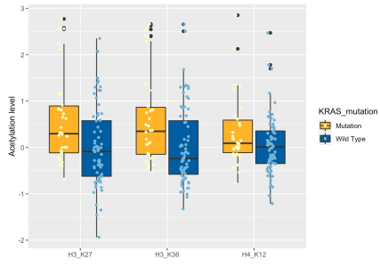

# README-Analysing EC dataset

## Introduction

Saved here is the final course project for my junior course: biostatistics. In this teamwork project, my classmates and I used the endometrial cancer dataset as the basic facts, and used a variety of basic statistical methods (descriptive statistics, t-tests, non-parametric tests, LASSO correlation coefficients) to explore the interrelationships between endometrial cancer gene mutations, histone acetylation levels, protein expression levels, and tumor subtypes. Project requirements can be found in the document :`Biostatistics-Project.pdf`。My part of the plotting code can be found in the `Biostatistics.Rmd` file.

## Endometrial Carcinoma(EC) dataset

The dataset comes from the following studies:

```
Dou Y, Kawaler EA, Cui Zhou D, et al. Proteogenomic Characterization of Endometrial Carcinoma. Cell. 2020;180(4):729-748.e26. doi:10.1016/j.cell.2020.01.026
```

## Result

Basic clinical information about the sample:


Presentation of each sample’ s copy number variation:


Correlation coefficients between acetylation levels and levels of key proteins:


Box plot of KRAS gene mutations grouped with site acetylation levels:



Box plot of ARID1A gene mutations grouped with site acetylation levels:


Screening for differential histone acetylation levels between `CNV high` and `CNV low`


## Conclusion

All details of the team's division of labour and the process of deriving conclusions can be found in our summary report: `summary.pdf` file. Here I briefly summarise our conclusions below:

+ there is indeed a correlation between (some) acetylation enzyme expression levels and (some) sample histone acetylation levels  
+ there were significant differences in the acetylation levels of these proteins of the wild type and mutant of these two key genes(ARID1A and KRAS).
+ For different tumour types, the levels of many acetylation sites show differences at the statistical level. Based on the biological functions of these sites, we were able to further deduce the relationship between the macroscopic symptoms of tumour subtype and the microscopic acetylation sites.  
